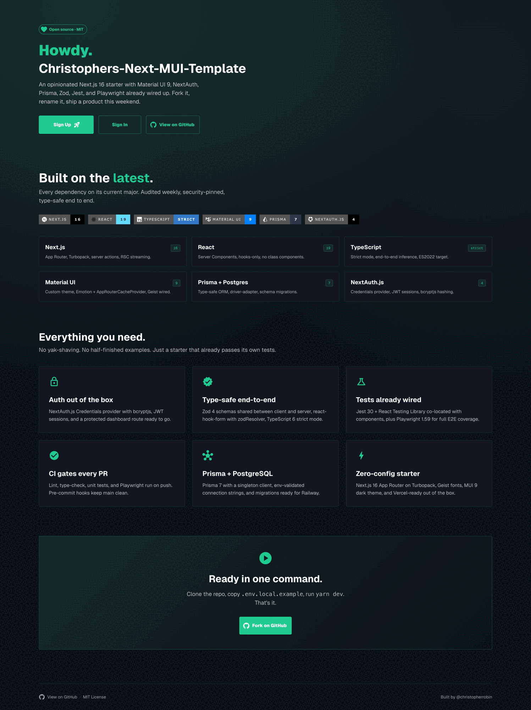

# Christophers-Next-MUI-Template



## A modern, minimal authentication starter for developers, built with Next.js, TypeScript, Prisma, and Material UI.

**Howdy!** This starter kit is designed for those who want a clean, extensible foundation for building modern, full-stack web applications with authentication using Next.js 16, TypeScript, Prisma, and Material UI.

## Stack

- **Next.js 16** with App Router (Turbopack default)
- **React 19**, **TypeScript 6** (strict)
- **Prisma 6** with PostgreSQL
- **Material UI 5** with Emotion (custom dark theme at `theme.ts`)
- **`@mui/icons-material`** for icons
- **Geist** fonts wired into the MUI theme
- **NextAuth.js 4** for authentication (email & password, JWT sessions)
- **Zod + react-hook-form** for form validation (shared client/server schemas)
- **bcrypt** (via bcryptjs) for secure password hashing

## Tooling & Features

- **ESLint** and **Prettier** for code quality
- **Unit & Component Testing** with Jest & Testing Library
- **End-to-End (E2E) Testing** with Playwright
- User registration and login flows
- Protected dashboard for authenticated users

## Getting Started

Clone and set up the project in minutes:

### Prerequisites

- Node.js 24+ (a `.nvmrc` is provided — run `nvm use`)
- PostgreSQL database

### Installation

1. Clone the repository:
   ```bash
   git clone https://github.com/christopherrobin/Christophers-Next-MUI-Template
   cd Christophers-Next-MUI-Template
   ```
2. Install dependencies:
   ```bash
   yarn install
   ```
3. Configure environment variables:
   - Copy `.env.local.example` to `.env.local` and fill in your database and secret values.
4. Run Prisma migrations:
   ```bash
   yarn prisma migrate deploy
   ```
5. Start the development server:
   ```bash
   yarn dev
   ```

Visit [http://localhost:3000](http://localhost:3000) to view the app.

## Project Structure

- `theme.ts` — Centralized MUI theme (dark palette, Geist typography, component overrides)
- `src/app/` — Next.js App Router pages (home, sign-up, sign-in, dashboard, `not-found.tsx`)
- `src/components/` — Reusable UI components (Spinner, Providers)
- `src/lib/` — Prisma client, NextAuth config, env validation (`env.ts`), API helpers (`api-utils.ts`), shared Zod schemas (`schemas.ts`)
- `src/proxy.ts` — Next 16 middleware (route protection and auth redirects)
- `prisma/` — Prisma schema and migrations
- `public/` — Static assets and icons
- `e2e/` — End-to-end tests

Unit/component tests are co-located next to source files (e.g. `Spinner.tsx` + `Spinner.test.tsx`).

## Customization

Extend or modify any part to fit your project:

- Add new pages or API routes in `src/app/`
- Create custom UI components in `src/components/`
- Adjust authentication logic in `src/lib/auth.ts`
- Update styles via MUI config or CSS

## Scripts

- `yarn dev` — Start development server
- `yarn build` — Build for production
- `yarn start` — Start production server
- `yarn prisma:migrate` — Deploy database migrations
- `yarn lint` / `yarn lint:fix` — Lint code
- `yarn format` / `yarn format:fix` — Format code
- `yarn run nuke` — Remove node_modules, reinstall dependencies, and rebuild
- `yarn run clean` — Lint, format, and prettify all code

## Environment Variables

- `DATABASE_PUBLIC_URL` — PostgreSQL connection string
- `NEXTAUTH_SECRET` — Secret for NextAuth.js (generate with `openssl rand -base64 32`)
- `NEXTAUTH_URL` — Canonical site URL (e.g. `http://localhost:3000`)

## Authentication & Routing

The included `src/proxy.ts` (Next 16's renamed middleware) enforces:

- `/dashboard/*` requires authentication (unauth users are redirected to `/sign-in?callbackUrl=...`)
- `/sign-in` and `/sign-up` redirect authenticated users to `/dashboard`
- `/` is public for everyone

## Forms & Validation

Sign-in and sign-up forms use **react-hook-form + Zod** via `zodResolver`, with MUI's `<Controller>` pattern wrapping `<TextField>`. Schemas live in `src/lib/schemas.ts` and are used by both the client form and the server-side `safeParse` in `/api/sign-up/route.ts` — one source of truth, type-inferred via `z.infer`. Forms set `noValidate` so RHF owns validation (not native HTML5).

## Theming

The MUI theme lives at `theme.ts` (dark mode, primary `#20cb91`). Geist Sans is wired in via:

```ts
typography: { fontFamily: 'var(--font-geist-sans)', ... }
```

The font itself is loaded with `next/font/google` in `src/app/layout.tsx`. Without the `theme.ts` wiring, MUI components fall back to Roboto regardless of body styles.

## Testing

This project supports two main testing methods:

- **Unit & Component Testing** (Jest + Testing Library):

  - Run all tests: `yarn test`
  - Run a specific test file: `yarn test src/components/Spinner.test.tsx`
  - Tests are co-located next to the components they cover (e.g. `Spinner.tsx` + `Spinner.test.tsx`).
  - Uses [@testing-library/react](https://testing-library.com/docs/react-testing-library/intro/) and [@testing-library/user-event](https://testing-library.com/docs/ecosystem-user-event/) for React component interaction and assertions.

- **End-to-End (E2E) Testing** (Playwright):
  - Run all E2E tests: `yarn test:e2e`
  - Specs live in the `e2e/` directory.
  - Uses [Playwright](https://playwright.dev/) for browser-based end-to-end testing.

## License

This project is open source and available under the [MIT License](LICENSE).
