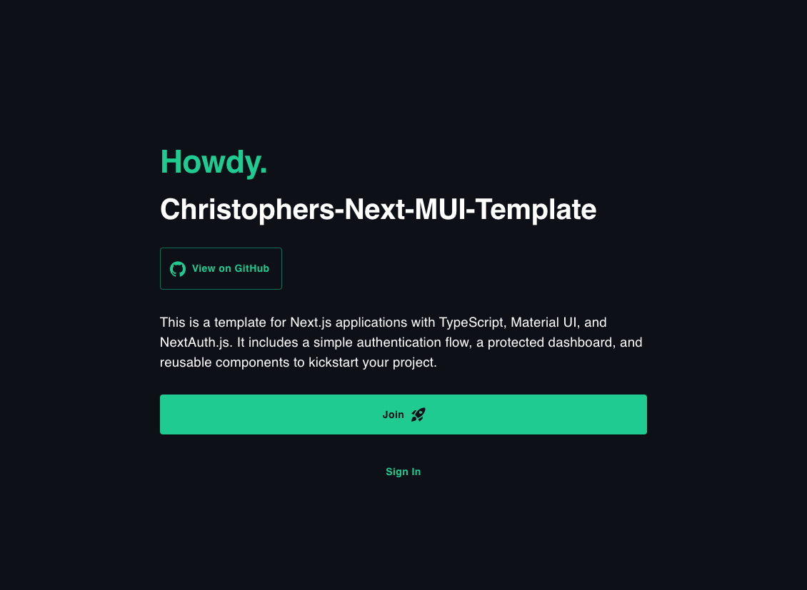

# Christophers-Next-MUI-Template



## A modern, minimal authentication starter for developers, built with Next.js, TypeScript, Prisma, and Material UI.

**Howdy!** This starter kit is designed for those who want a clean, extensible foundation for building modern, full-stack web applications with authentication using Next.js 15, TypeScript, Prisma, and Material UI.

## Stack

- **Next.js 15** with App Router
- **TypeScript** for type safety
- **Prisma** ORM with PostgreSQL
- **Material UI** for styling
- **NextAuth.js** for authentication (email & password)
- **bcrypt** (via bcryptjs) for secure password hashing

## Tooling & Features

- **ESLint** and **Prettier** for code quality
- **Unit & Component Testing** with Jest & Testing Library
- **End-to-End (E2E) Testing** with Playwright
- User registration and login flows
- Protected dashboard for authenticated users

## Getting Started

Clone and set up the project in minutes:

### Prerequisites

- Node.js 18+
- PostgreSQL database

### Installation

1. Clone the repository:
   ```bash
   git clone https://github.com/christopherrobin/Christophers-Next-MUI-Template
   cd Christophers-Next-MUI-Template
   ```
2. Install dependencies:
   ```bash
   yarn install
   ```
3. Configure environment variables:
   - Copy `.env.local.example` to `.env.local` and fill in your database and secret values.
4. Run Prisma migrations:
   ```bash
   yarn prisma migrate deploy
   ```
5. Start the development server:
   ```bash
   yarn dev
   ```

Visit [http://localhost:3000](http://localhost:3000) to view the app.

## Project Structure

- `src/app/` — Next.js App Router pages (home, join, sign-in, dashboard)
- `src/components/` — Reusable UI components (Button, Spinner, Providers)
- `src/lib/` — Prisma and authentication logic
- `prisma/` — Prisma schema and migrations
- `public/` — Static assets and icons
- `__tests__/` — Unit and component tests
- `e2e/` — End-to-end tests

## Customization

Extend or modify any part to fit your project:

- Add new pages or API routes in `src/app/`
- Create custom UI components in `src/components/`
- Adjust authentication logic in `src/lib/auth.ts`
- Update styles via MUI config or CSS

## Scripts

- `yarn dev` — Start development server
- `yarn build` — Build for production
- `yarn start` — Start production server
- `yarn prisma:migrate` — Deploy database migrations
- `yarn lint` / `yarn lint:fix` — Lint code
- `yarn format` / `yarn format:fix` — Format code
- `yarn run nuke` — Remove node_modules, reinstall dependencies, and rebuild
- `yarn run clean` — Lint, format, and prettify all code

## Environment Variables

- `DATABASE_PUBLIC_URL` — PostgreSQL connection string
- `NEXTAUTH_SECRET` — Secret for NextAuth.js

## Testing

This project supports two main testing methods:

- **Unit & Component Testing** (Jest + Testing Library):

  - Run all tests: `yarn test`
  - Run a specific test file: `yarn test __tests__/Button.test.tsx`
  - Uses [@testing-library/react](https://testing-library.com/docs/react-testing-library/intro/) and [@testing-library/user-event](https://testing-library.com/docs/ecosystem-user-event/) for React component interaction and assertions.

- **End-to-End (E2E) Testing** (Playwright):
  - Run all E2E tests: `yarn test:e2e`
  - Uses [Playwright](https://playwright.dev/) for browser-based end-to-end testing.

See the test files in `__tests__/` and `e2e/` directories for examples.

## License

This project is open source and available under the [MIT License](LICENSE).
